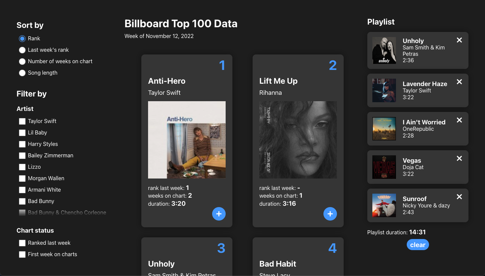

**Who:** Just me

**What:** 

**When:** November 2022

**Where:** Brown University's CSCI 1300 UI/UX course

**Why:**
- Practice using functional components in React
- Use modular design to create an interface which can adapt to different datasets
  

**How:**
Built in React and deployed on Github pages

**Can I try it?**
You can view the final website [here]().

