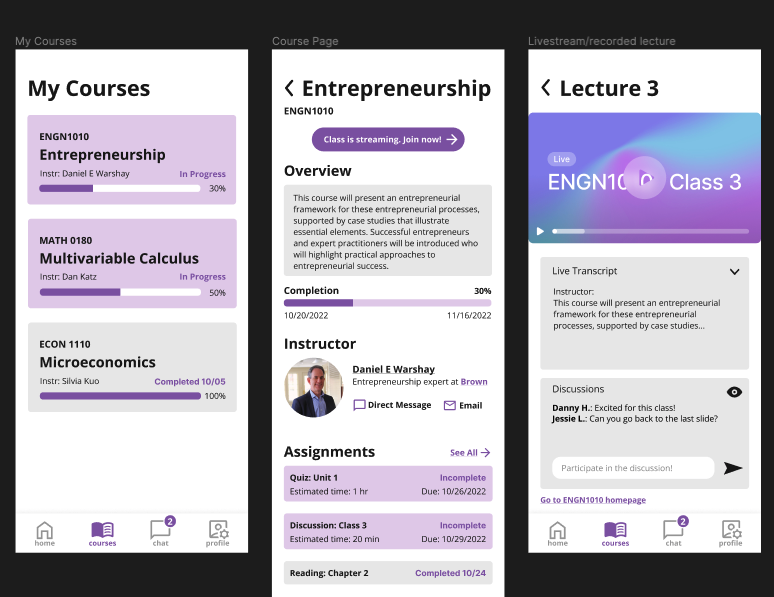

**Who:** Me and 3 other Brown University juniors (Firstname Lastname, Firstname Lastname, and Firstname Lastname)

**What:** App prototype for the corporate online education service startup [Sphere]()

**When:** November 2022

**Where:** Brown University's CSCI 1300 UI/UX course

**Why:**
- Experience working through the design process in a team setting
- Practice a continuous design process of iterating on designs based on critique feedback
- Learn how to perform user testing to observe interface usability and identify weaknesses

  

**How:**
Prototyped in Figma

**Can I try it?**
You can view the final prototype [here]().

